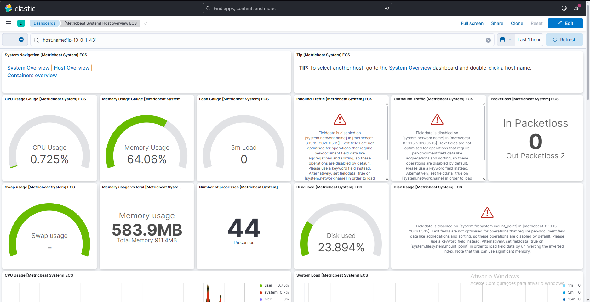
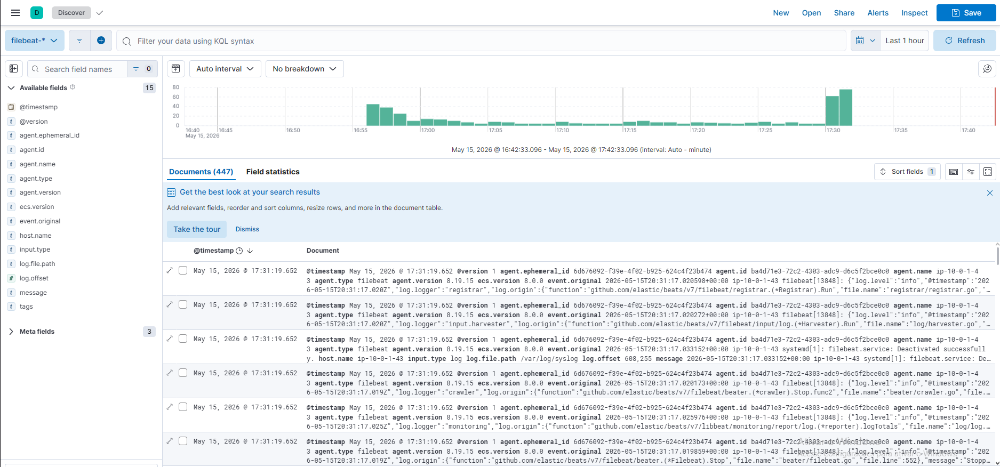
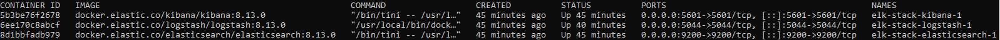
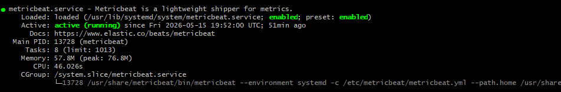

# 🛡️ AWS ELK SIEM Lab

A home SOC lab built on AWS Free Tier, using the ELK Stack for real-time security monitoring and observability of a vulnerable web application environment.

---

## 📐 Architecture

```
┌─────────────────────────────┐        Tailscale VPN Tunnel
│        AWS EC2 (t3.micro)   │ ──────────────────────────────►  WSL2 (Local Machine)
│                             │                                  ┌──────────────────┐
│  ┌─────────┐  ┌──────────┐  │                                  │  Elasticsearch   │
│  │  DVWA   │  │ Filebeat │  │ ──── logs/metrics ────────────► │  Logstash :5044  │
│  │ (Docker)│  │Metricbeat│  │                                  │  Kibana :5601    │
│  └─────────┘  └──────────┘  │                                  └──────────────────┘
└─────────────────────────────┘
```

---

## 🧰 Stack

| Component | Role |
|-----------|------|
| AWS EC2 t3.micro (Ubuntu 24.04) | Hosts DVWA and Beats agents |
| DVWA (Docker) | Intentionally vulnerable web app for attack simulation |
| Filebeat | Ships system logs from EC2 to Logstash |
| Metricbeat | Ships system metrics (CPU, memory, disk) from EC2 |
| Tailscale VPN | Secure private tunnel between EC2 and local ELK stack |
| Logstash | Ingests and processes data from Beats |
| Elasticsearch | Stores and indexes all logs and metrics |
| Kibana | Visualizes data via pre-built security dashboards |

---

## 🔒 Security Setup

- AWS account hardened with MFA and IAM admin user (no root usage)
- Billing alert configured at $1 threshold
- EC2 Security Group with least-privilege rules:
  - SSH (22) → My IP only
  - HTTP (80) → Public (DVWA access)
  - Logstash (5044) → Tailscale network only
- All log shipping goes through Tailscale VPN — no public exposure of ELK stack
- ELK stack runs locally (WSL2), never exposed to the internet

---

## 📡 Data Pipeline

```
EC2 System Logs ──► Filebeat ──► Tailscale VPN ──► Logstash :5044 ──► Elasticsearch ──► Kibana
EC2 Metrics     ──► Metricbeat ──────────────────────────────────────────────────────────────────►
```

Indices created:
- `filebeat-8.19.15-YYYY.MM.DD`
- `metricbeat-8.19.15-YYYY.MM.DD`

---

## 📊 Dashboards

Kibana dashboards loaded via `metricbeat setup --dashboards` and `filebeat setup --dashboards`:

- **[Metricbeat System] Host Overview ECS** — CPU, memory, disk, process count
- **[Metricbeat System] Overview ECS** — Multi-host overview
- **[Filebeat System] Syslog Dashboard ECS** — System log events

---

## 🏗️ Infrastructure

| Resource | Config |
|----------|--------|
| VPC | `10.0.0.0/16` |
| Public Subnet | `10.0.1.0/24` |
| Internet Gateway | Attached to VPC |
| EC2 Instance | t3.micro — Ubuntu 24.04 LTS |
| Tailscale | Private mesh VPN — no open inbound ports for ELK |

---

## 🚀 Setup Overview

1. AWS account setup — MFA, IAM, billing alert, CLI
2. VPC, subnet, IGW, route table, security group
3. EC2 launch — Docker install, DVWA deployment
4. Tailscale install on EC2 and WSL2
5. ELK Stack via Docker Compose on WSL2
6. Filebeat + Metricbeat install on EC2, configured to send via Tailscale
7. Kibana index patterns and dashboards setup

---

## 📸 Screenshots

> Kibana Host Overview — real-time EC2 metrics



> Kibana Discover — live log stream from EC2



> ELK Stack containers running on WSL2



> Metricbeat service running on EC2



---

## 🎯 Skills Demonstrated

- Cloud infrastructure provisioning on AWS (VPC, EC2, Security Groups)
- Docker and Docker Compose for service orchestration
- ELK Stack deployment and configuration
- Log shipping with Beats (Filebeat, Metricbeat)
- Network security with Tailscale VPN
- Security monitoring and observability
- Linux administration (Ubuntu, systemd, WSL2)

---

## ⚠️ Disclaimer

DVWA is an intentionally vulnerable application used strictly for educational purposes in an isolated lab environment. It is not exposed beyond the intended attack surface.
